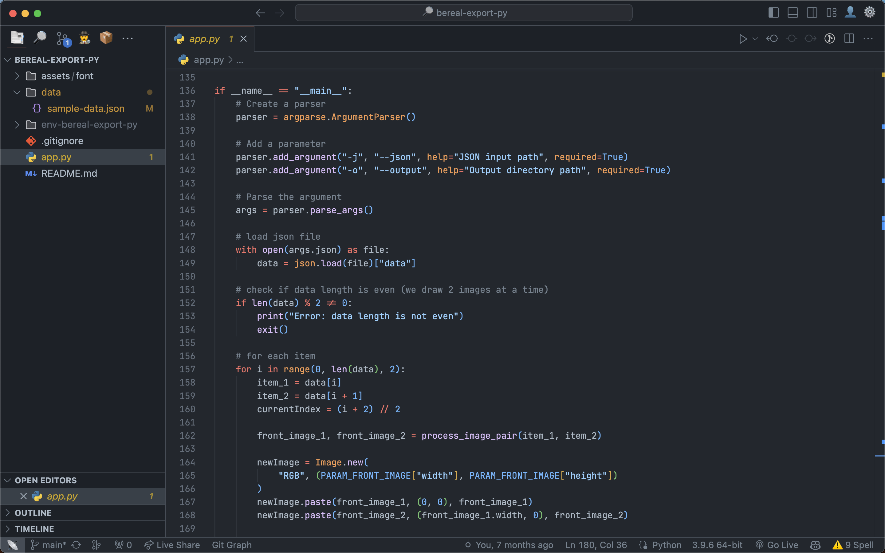
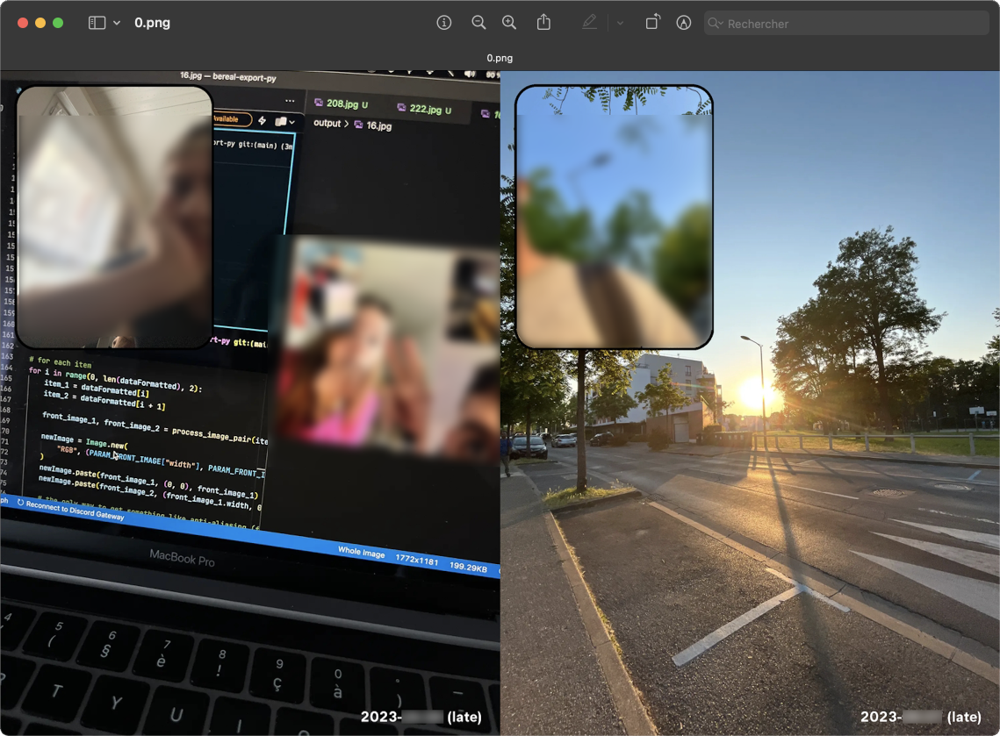

- [Le projet GitHub](https://github.com/baptistejouin/bereal-export)

BeReal Export est un outil que j'ai développé pendant mes pauses pendant l'été 2023.

BeReal est une application qui propose à ses utilisateurs de prendre deux photos simultanément par jour (une avec la caméra avant et une avec la caméra arrière). Ces photos sont ensuite partagées avec nos amis.

L'application ne propose pas d'exporter toutes les photos simultanément ; il faut donc les télécharger une par une. J'ai donc décidé de créer un outil qui permet de télécharger toutes les photos en une fois.

À noter que chaque photo est associée à une autre (photo prise au même instant), et que l'affichage d'un BeReal est bien spécifique : une photo en plein écran et l'autre en vignette en haut à droite, cernée d'un cadre noir.

Il m'a donc fallu télécharger les photos à partir de leurs URL, les redimensionner et les placer dans une présentation identique à celle de l'application. Pour cela, j'ai utilisé la bibliothèque Pillow.

Je souhaitais par la suite les imprimer et les mettre dans un album photo, donc respecter le format (10 cm x 15 cm). Je souhaitais également qu'une feuille de papier photo contienne 2 BeReal, donc 4 photos.

J'ai également récupéré certaines de mes données depuis l'API privée de BeReal.
