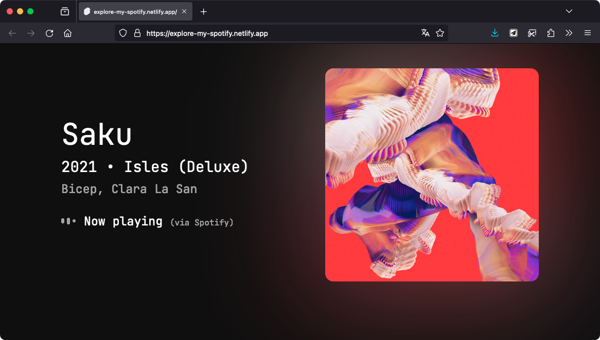
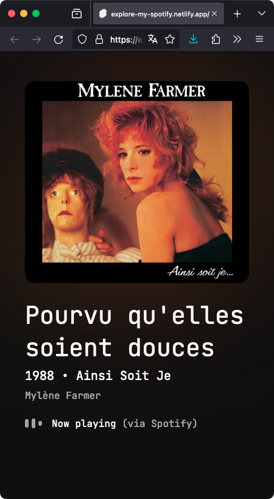
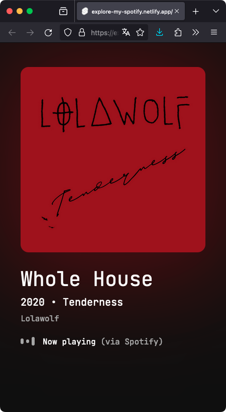

"Explore My Spotify" est une application web que j'ai développée pendant mon temps libre. Étant un grand utilisateur de Spotify et fan de musique en général, j'ai eu envie de créer une petite application avec l'API publique de Spotify. [Voir le site](https://explore-my-spotify.netlify.app/)

Cette application web permet de visualiser les musiques que j'écoute en direct.

J'ai d'abord réalisé une maquette pour me donner une idée de ce que je voulais faire. Puis j'ai commencé à développer en utilisant Svelte avec TypeScript, un framework en vogue que je souhaitais découvrir.

J'ai mis en place, grâce à la bibliothèque `@tanstack/svelte-query`, un système de cache, ainsi qu'une détection du focus de la page pour ne pas faire de requête inutile tout en gardant les données à jour en temps réel. [Voir le code source](https://github.com/baptistejouin/explore-my-spotify)

J'ai également placé l'API Spotify derrière une API auto-hébergée sur la même adresse, afin d'exposer publiquement uniquement les données que je souhaitais utiliser.

