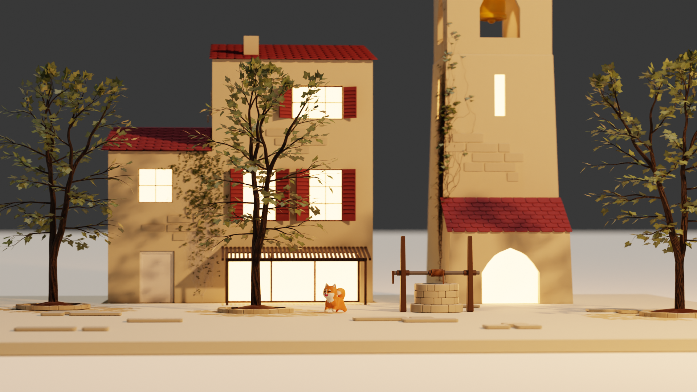

Au quatrième semestre de l'IMAC, nous avons suivi un cours d'animation 3D. Nous avons utilisé le logiciel Blender pour réaliser une animation de 4 secondes. Nous devions imaginer, modéliser et animer une scène ; le thème de cette année était "La dualité".

J'ai choisi de représenter une place de village dans une ambiance méditerranéenne.

Voici la vidéo finale de tous les projets :

<iframe
  src="https://www.youtube.com/embed/9QyrhAM1LBw?si=5huVG0d0IlP0mqe9"
  title="YouTube video player"
  frameborder="0"
  allow="accelerometer; autoplay; clipboard-write; encrypted-media; gyroscope; picture-in-picture; web-share"
  allowfullscreen
></iframe>
