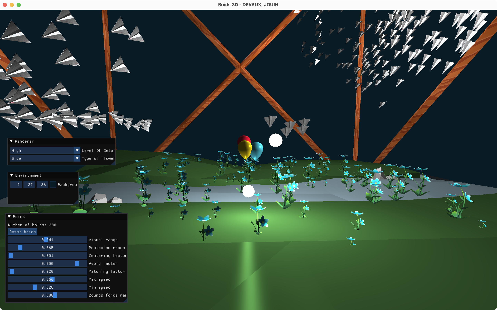
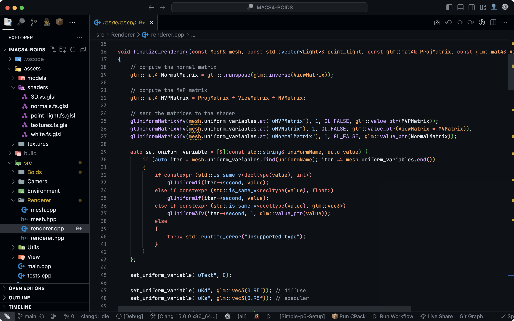
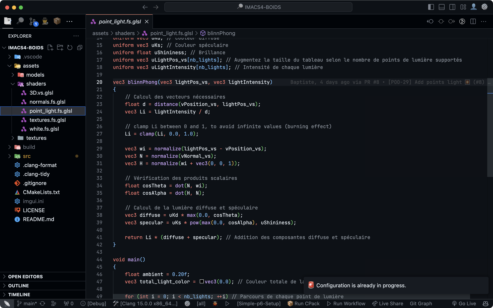

Le projet Boids IMAC est un projet réalisé dans le cadre du cours de Synthèse d'Images à l'IMAC. Nous devions créer une simulation de boids en C++ avec OpenGL (dernière version) et GLSL pour les shaders.

Nous avons dû implémenter les règles de cohésion, séparation et alignement pour simuler le comportement des boids.

Nous devions gérer un grand nombre de boids, et les faire se déplacer dans un espace 3D.

C'est le deuxième projet que j'ai réalisé en binôme en C++. Nous avons appris à utiliser les shaders GLSL pour le rendu des boids. Nous avons également dû gérer les textures, les objets 3D ainsi que les lumières pour rendre la simulation plus intéressante.

Le code est disponible sur [Github](https://github.com/baptistejouin/IMACS4-BOIDS).

Voici quelques fonction intéressantes du projet

