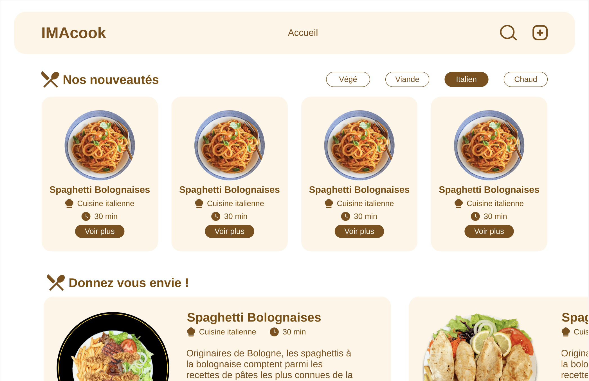
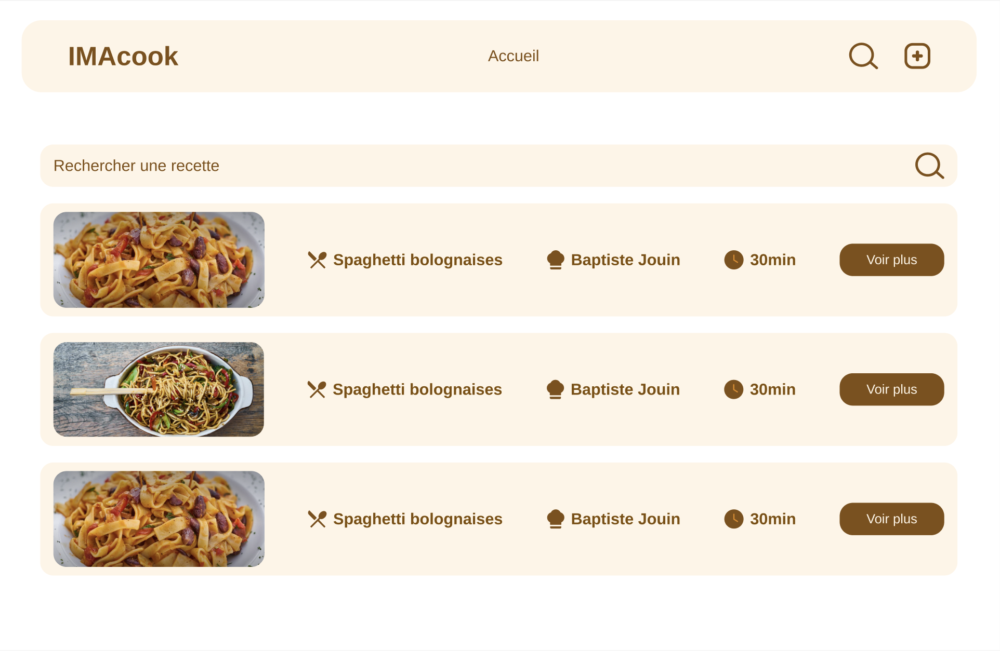
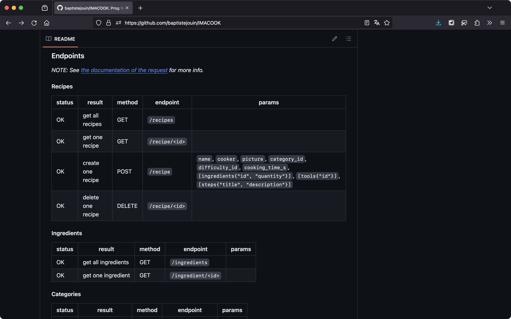

IMACOOK est un projet réalisé en groupe de 4 personnes dans le cadre de notre formation à l'IMAC. Nous devions créer une API en Python avec Flask et un site web en Vue.js qui utilise cette API.

Nous avons choisi de créer un site de recettes de cuisine basé sur la collaboration des étudiants de l'IMAC.

J'ai en grande partie travaillé sur la maquette du site, ainsi que sur le développement du back-end avec Flask en Python.

Il est possible d'ajouter des recettes via un formulaire, de les modifier, de les supprimer et de les consulter.

La page d'accueil affiche les recettes les plus récentes, et il est possible de les filtrer par catégorie. Il est également possible de rechercher une recette par son nom.

J'ai également mis en place une documentation de l'API sur GitHub en markdown afin que l'équipe front-end puisse l'utiliser en parallèle du développement du site.

Le dépôt du projet est disponible sur [Github](https://github.com/baptistejouin/IMACOOK).
