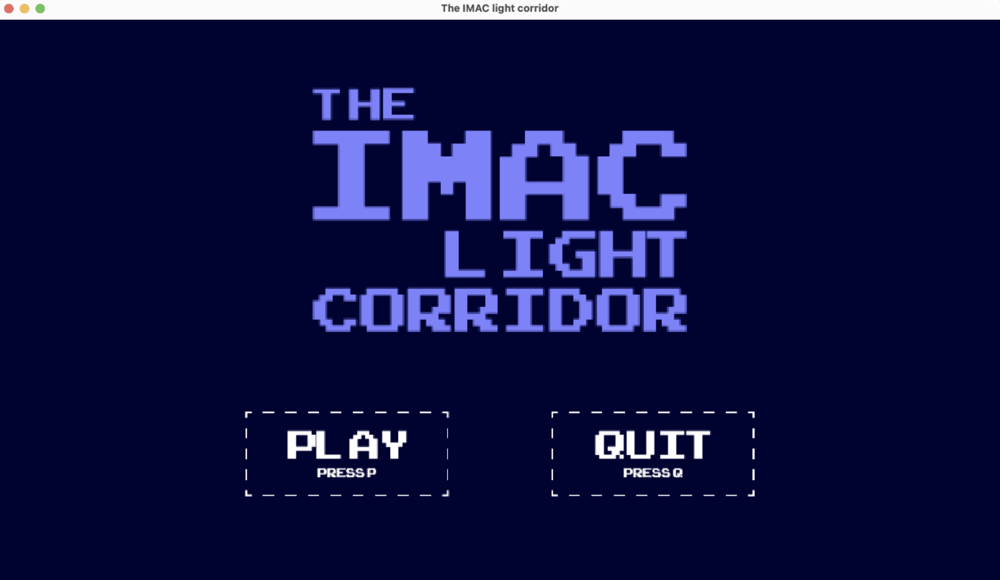
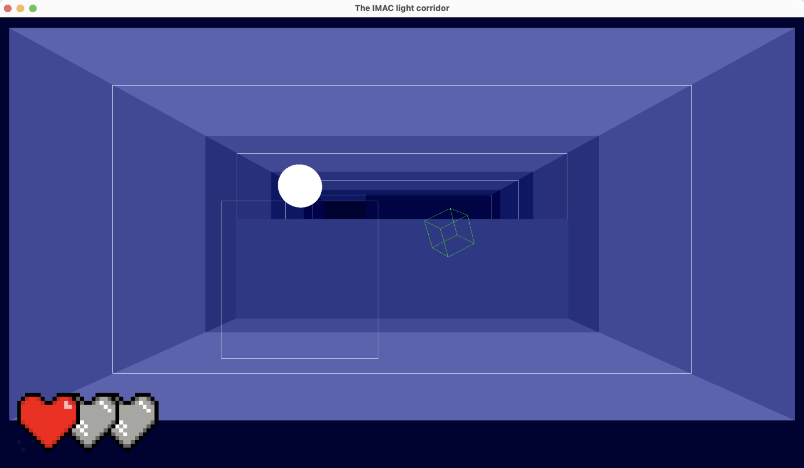

Le Light Corridor IMAC est un projet réalisé dans le cadre de notre formation à l'IMAC. Nous devions créer un remake du jeu The Light Corridor, sorti en 1990 sur Amiga, en C++ avec OpenGL.

Nous devions concevoir un menu principal, un menu de pause et un menu de fin de partie.

Le jeu est plutôt simple en pratique : le joueur doit avancer dans un couloir en faisant rebondir une balle sur les murs. Il doit éviter les obstacles et empêcher la balle de sortir du couloir. Il peut également récupérer des bonus qui lui permettent de gagner des points ou de la vie.

C'est le premier projet assez conséquent que j'ai réalisé en C++. Nous avons appris seulement après coup l'architecture en classes et le pipeline de rendu. Nous avons donc dû nous débrouiller pour créer notre propre architecture. Le code est disponible sur [Github](https://github.com/baptistejouin/the-imac-light-corridor).

Voici une vidéo du jeu fini :

<iframe src="https://www.youtube.com/embed/cS5yhfG6DRs?si=uSyWC71rGdGi7pbl" title="YouTube video player" frameborder="0" allow="accelerometer; autoplay; clipboard-write; encrypted-media; gyroscope; picture-in-picture; web-share" allowfullscreen></iframe>
