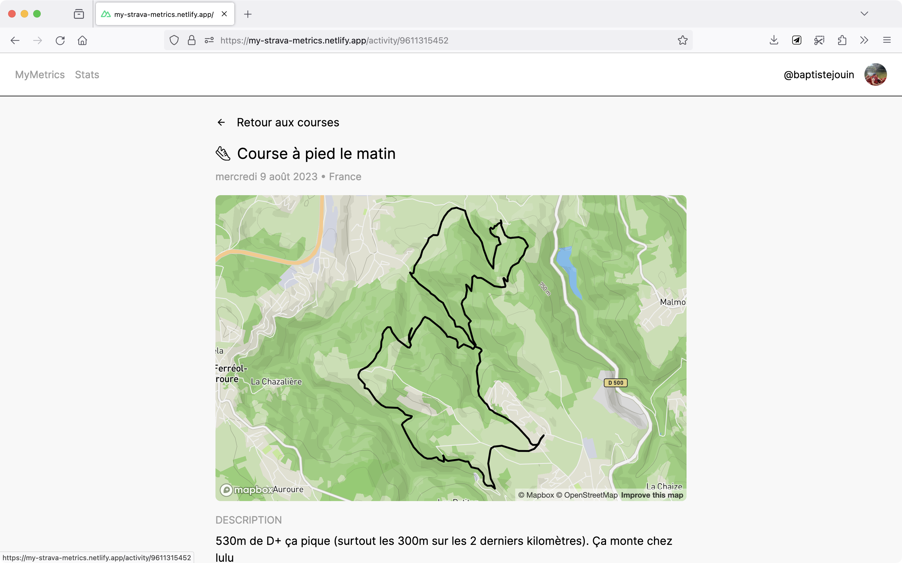
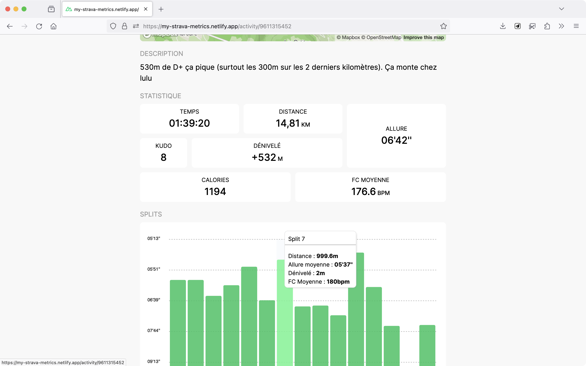

My Metrics est un projet réaliser dans le cadre d'un cours de developpement web.

La consigne était de réaliser un site web permettant de récupérer des données d'une API et de les afficher avec Vuejs. Étant un utilisateur de Strava, une application de suivi d'activité sportive et plus particulièrement de course à pied, j'ai décidé de récupérer mes données d'activité avec l'API Strava.

Comme j'avais déjà réalisé un projet similaire avec VueJS j'ai décidé de partir sur un projet plus complet en utilisant le framework français NuxtJS que je n'avais jamais utilisé.

Le site comprend une partie authentification avec Strava, une page d'accueil avec les données de ses dernières activités avec une carte et des informations réduite dans une card. Le tout peux être filtré et trié suivant plusieurs critères.

Chaque activité à sa propre page avec plus d'informations, une carte interactive et un graphique.

Le site est responsive et est disponible publiquement à l'adresse suivante : [https://my-strava-metrics.netlify.app/](https://my-strava-metrics.netlify.app/)

Le projet est open-source et est [disponible sur Github](https://github.com/baptistejouin/my-strava-metrics)
