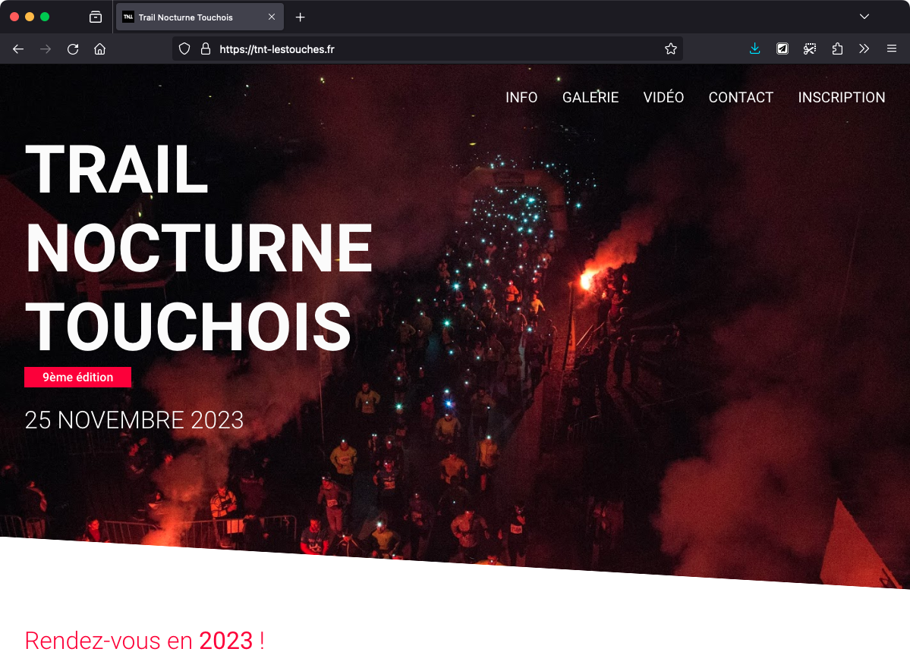
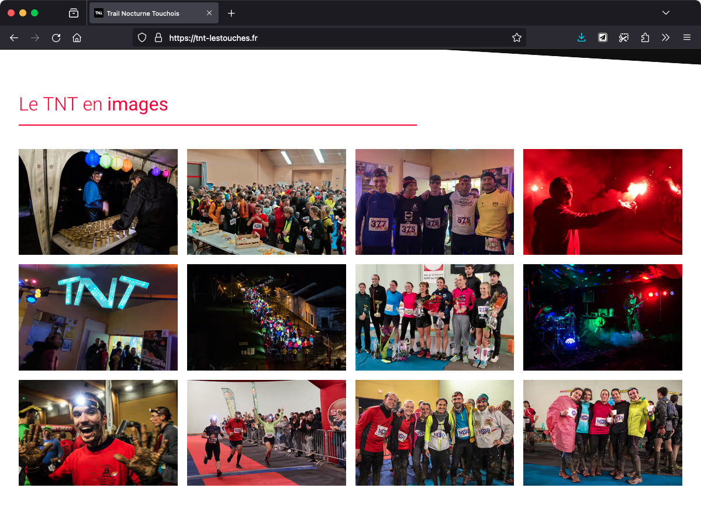

Le TNT est une course de trail nocturne organisée par l'association Touchois. J'ai réalisé, en 2019 en tant que freelance, le site web de l'événement.

Depuis peu, afin de faciliter la maintenance du site, j'ai décidé de migrer le site vers Astro, un framework SSG (Static Site Generator). Il permet de générer un site web statique à partir de fichiers Astro, un langage similaire à JSX, et de fichiers Markdown. Il permet également de scinder le code en composants et de les réutiliser.

Celui-ci supporte également SASS, TypeScript, et bien d'autres fonctionnalités.

Le projet est open-source et est [disponible sur Github](https://github.com/baptistejouin/trail-nocturne-touchois).
