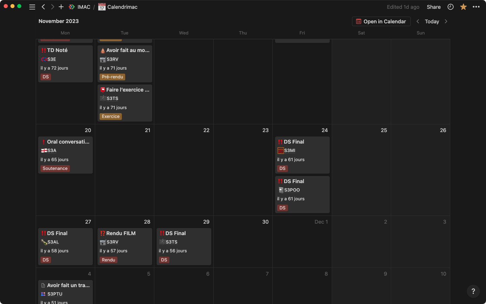
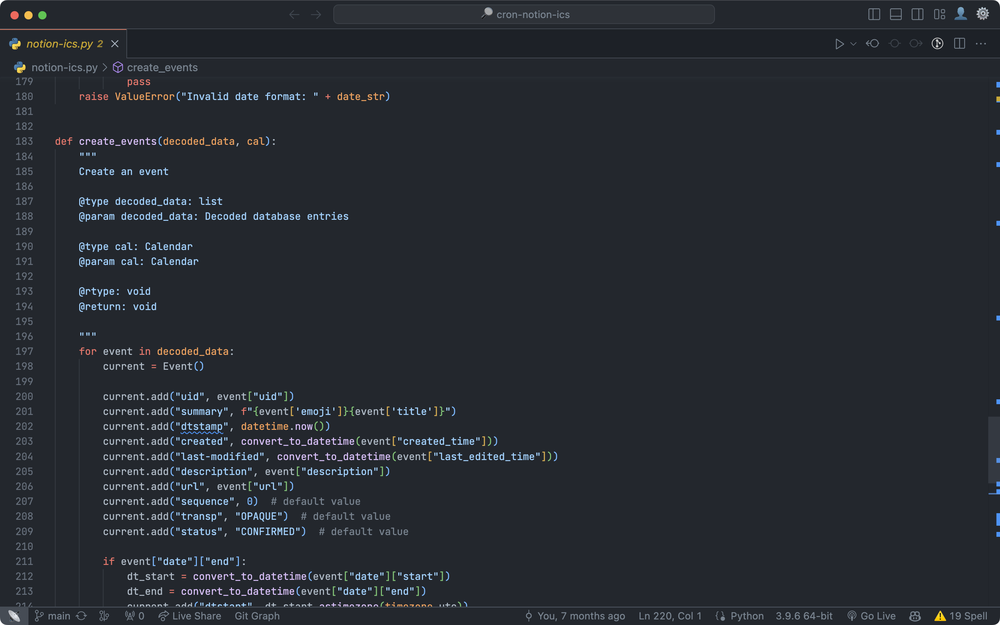
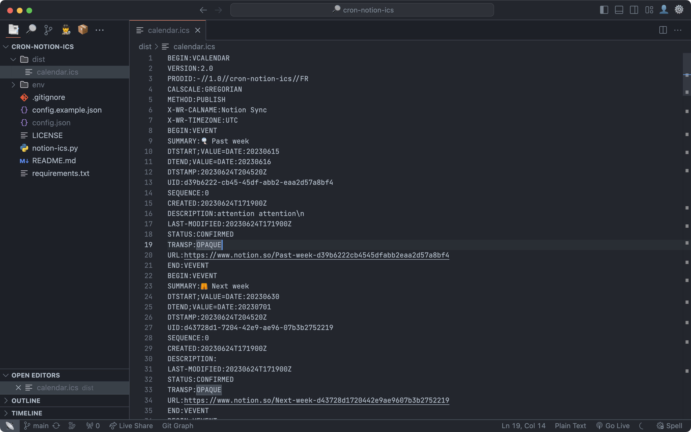
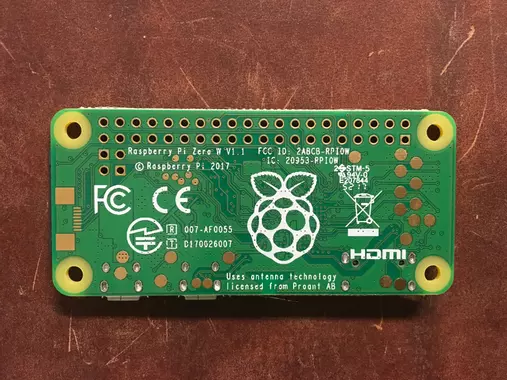

Ce projet est issue d'un besoin personnel. Je souhaitais pouvoir synchroniser mon calendrier Notion avec mon calendrier Google. Des solutions similaires existent déjà, mais sont payantes ou limitées face à mon besoin. J'ai donc décidé de développer ma propre solution.

Le principe est simple, j'ai développé un script Python qui récupère les données de mon calendrier Notion via API, puis qui génère un fichier ICS. Ce fichier est ensuite envoyé sur un serveur web, et est accessible publiquement. Il ne reste plus qu'à ajouter le lien du fichier ICS dans Google Agenda.

J'ai utilisé Python pour ce projet, car c'est un langage que j'avais deja utilisé, et que je souhaitais approfondir.

Une grande partie du travail a été de comprendre le fonctionnement de l'API Notion. Il a fallu également comprendre le format ICS, et comment le générer, et avec quelles données.

J'ai ensuite écrit une documentation pour expliquer comment utiliser le script, et comment l'installer sur un serveur web.

J'ai personnellement installé ce script sur un Raspberry Pi, mais il peut être installé sur n'importe quel serveur web. Le script est exécuté toutes les 5 minutes grâce à une tâche cron.

  

