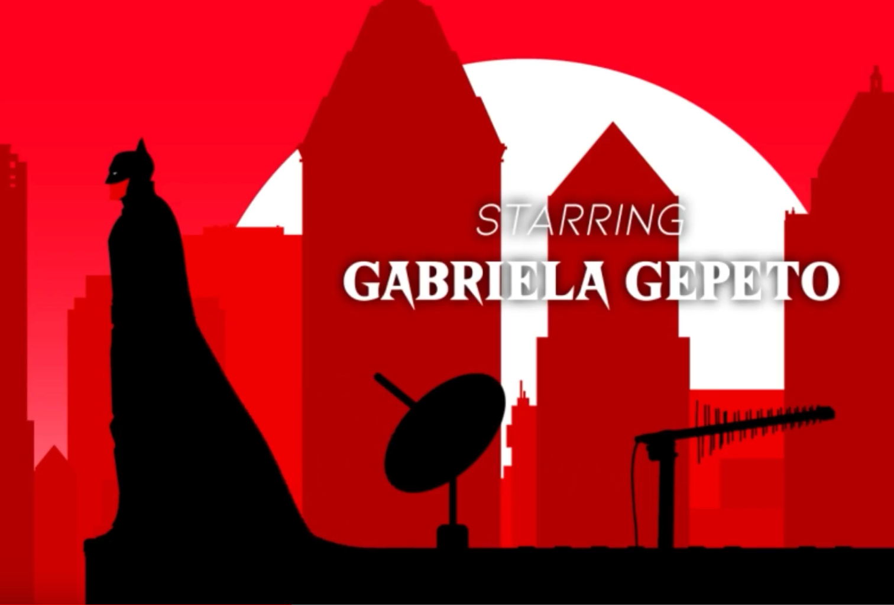
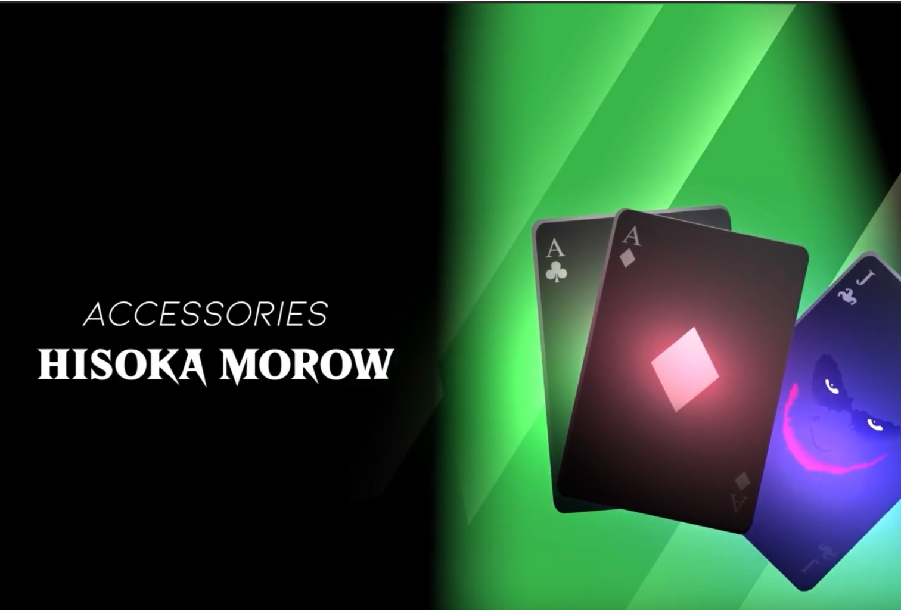
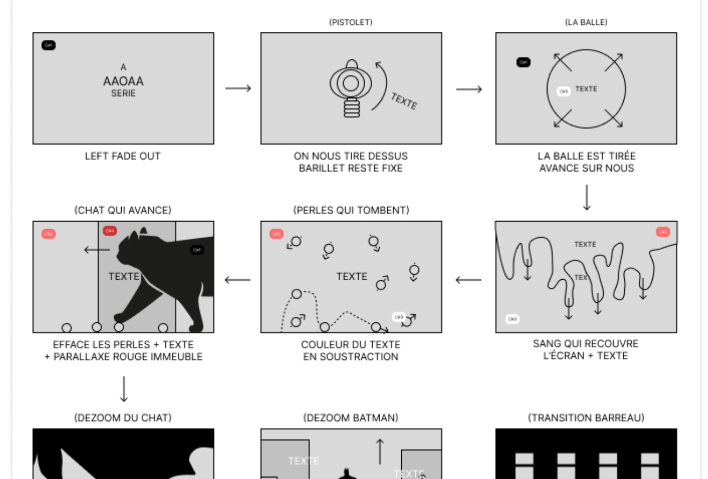
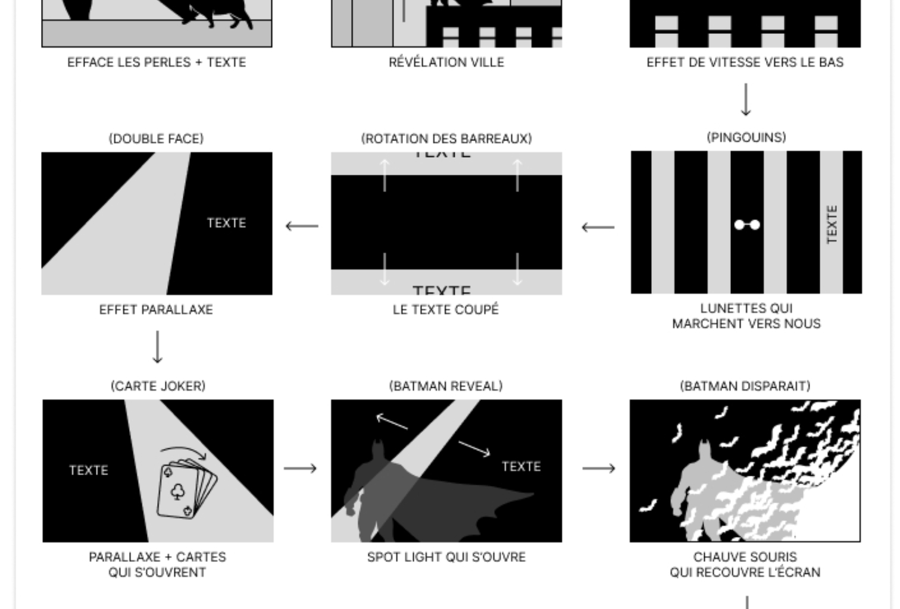

Batman 2D est un projet réalisé lors de ma première année à l'IMAC. Nous devions, par groupe, créer une animation 2D avec After Effects. Nous avons choisi de réaliser une animation sur le thème de Batman.

Je me suis occupé de certaines animations, et du storyboard.

<iframe
  src="https://www.youtube.com/embed/7U3Zkl_sOpU?si=LaI7fTkvnucGD-X5"
  title="YouTube video player"
  frameborder="0"
  allow="accelerometer; autoplay; clipboard-write; encrypted-media; gyroscope; picture-in-picture; web-share"
  allowfullscreen
></iframe>
