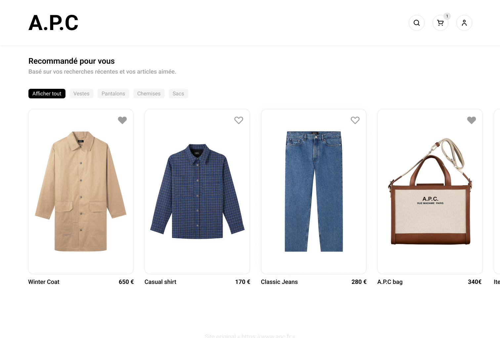

Afin de mettre en pratique mes connaissances en VueJS, j'ai décidé de créer un site ecommerce fictif. J'ai choisi de créer un site pour la marque de vêtements APC, car j'aime beaucoup leur univers et leur site actuel est assez minimaliste, ce qui est parfait pour un premier projet.

Le site est disponible à l'adresse suivante : [https://simple-eshop-vuejs.netlify.app/](https://simple-eshop-vuejs.netlify.app/)

J'ai commencé par créer un wireframe du site avec Figma, afin de définir les différentes pages et leur contenu.

J'ai ensuite créé le site avec VueJS, en utilisant le framework TailwindCSS pour le style. J'ai également utilisé le plugin Vue Router et VueX.

Le repository du projet est disponible sur [Github ici](https://github.com/baptistejouin/simple-eshop-vuejs).
