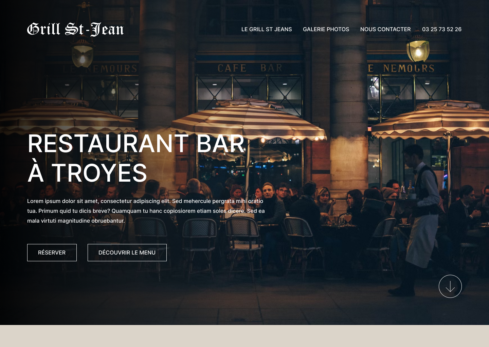
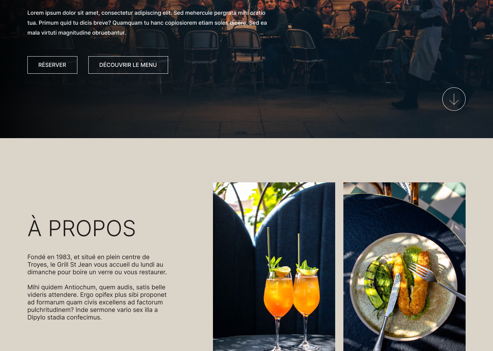
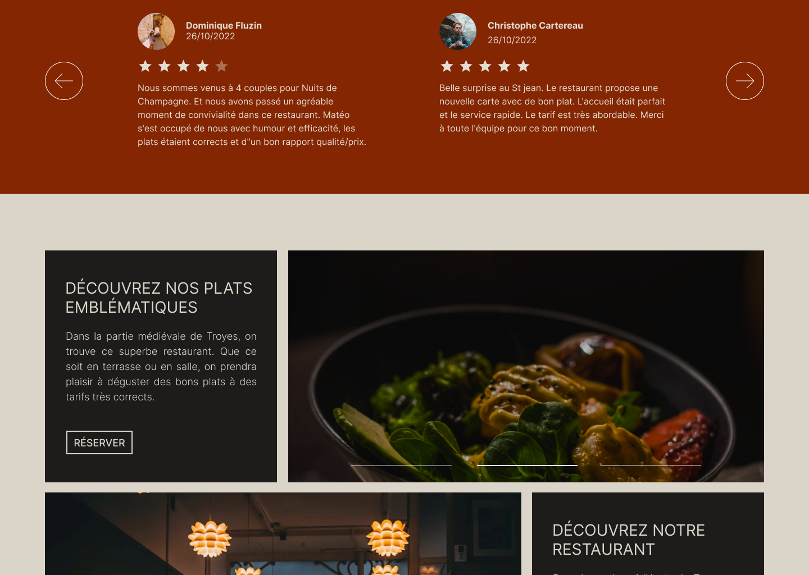
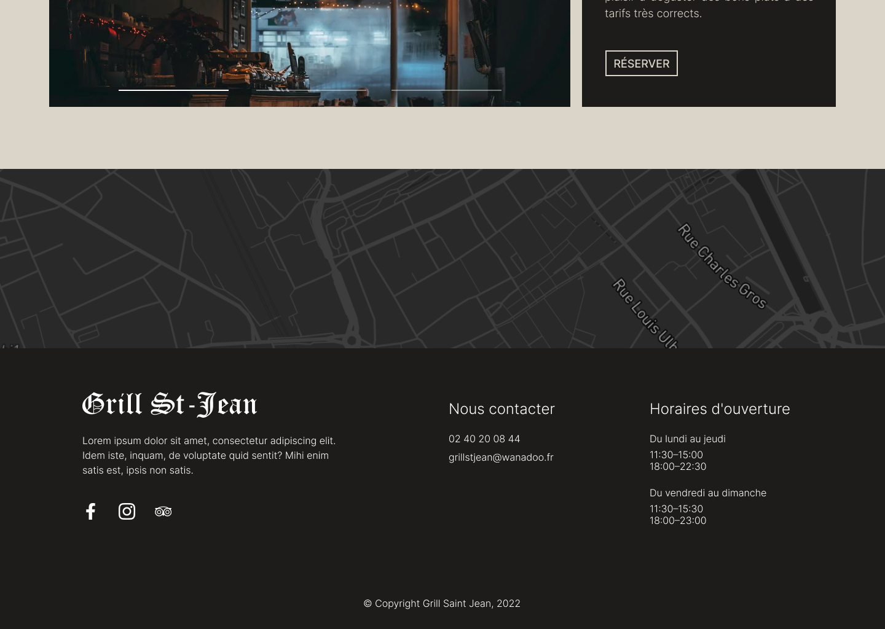

En tant que freelance j'ai réalisé avec un ami un site pour un restaurant à Troyes, le Grill St Jean.

Le lien du site : [https://grill-st-jean.fr/](https://grill-st-jean.fr/)

Nous avons evalué les besoins du client et nous avons réalisé une maquette sur Figma. Nous avons ensuite réalisé le site en PHP avec Sass. Utilisation de Git pour le versionning et la collaboration.
