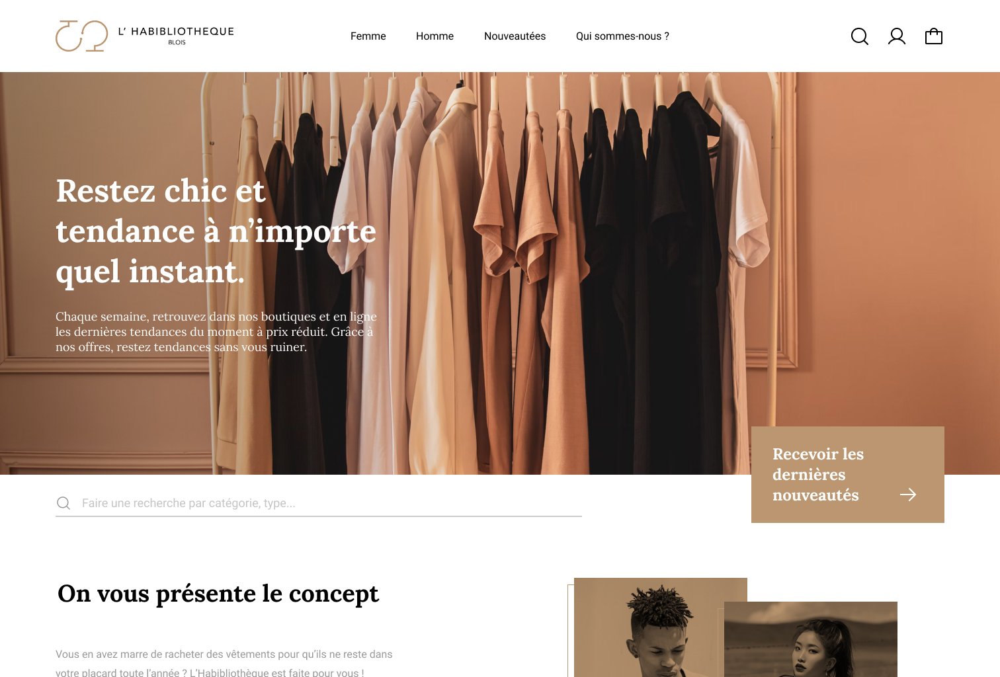
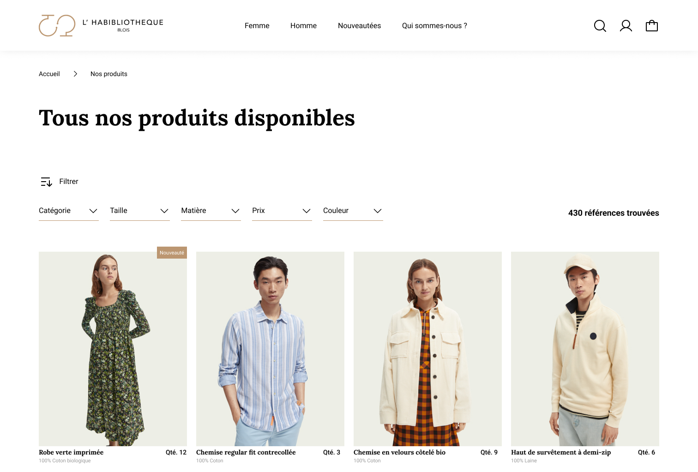

L’Habibliothèque est un projet universitaire. Nous devions concevoir un logo ainsi qu’une maquette d’un magasin fictif.

Ce travail a été réalisé en plusieurs étapes : tout d’abord une phase de recherche, comment traduire le concept graphiquement. Puis la réalisation de prototypes, à partir des différentes idées, et enfin des tests utilisateurs.

