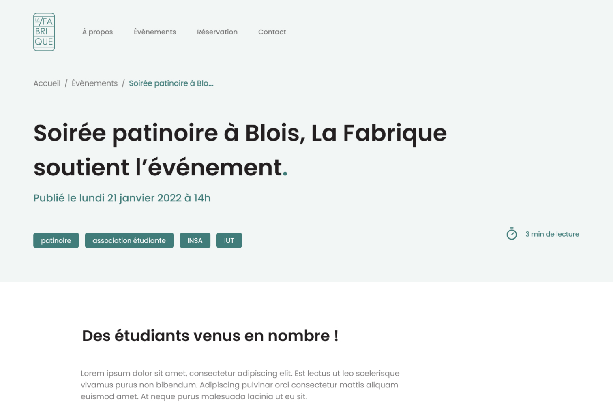
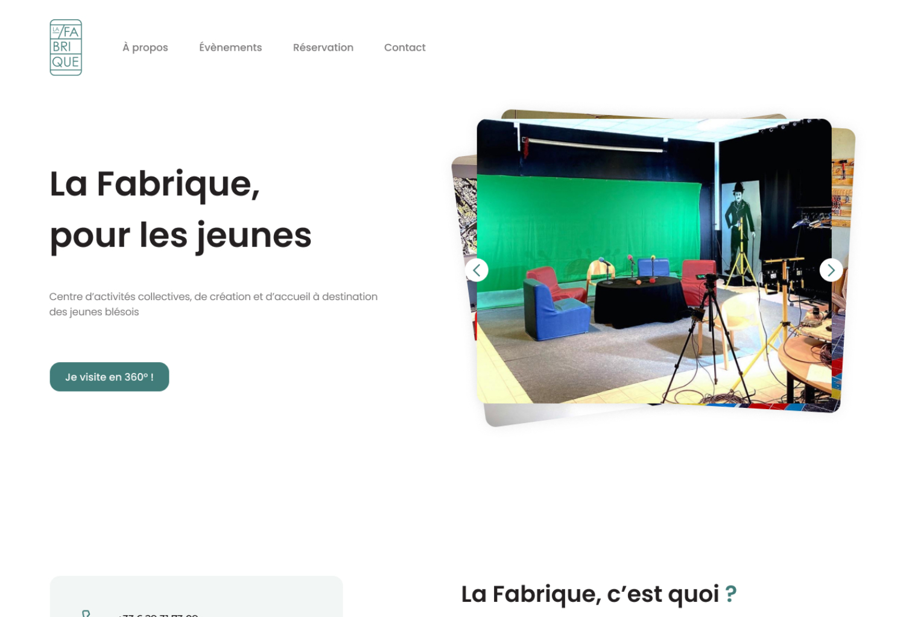
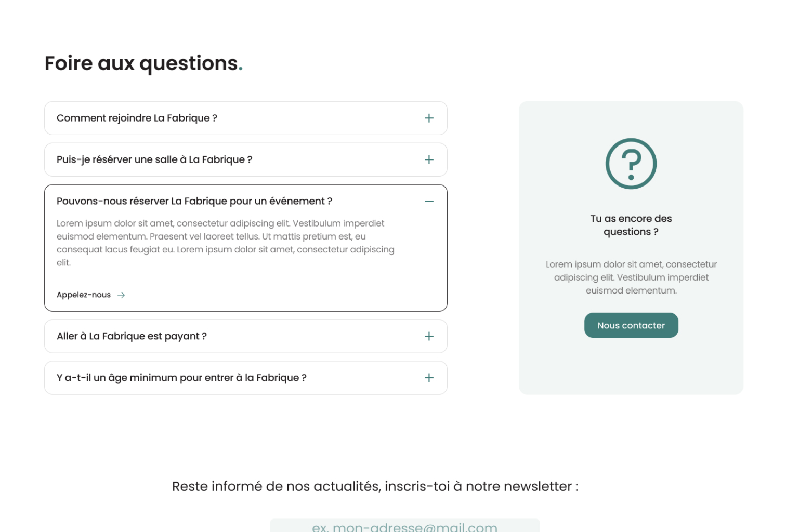
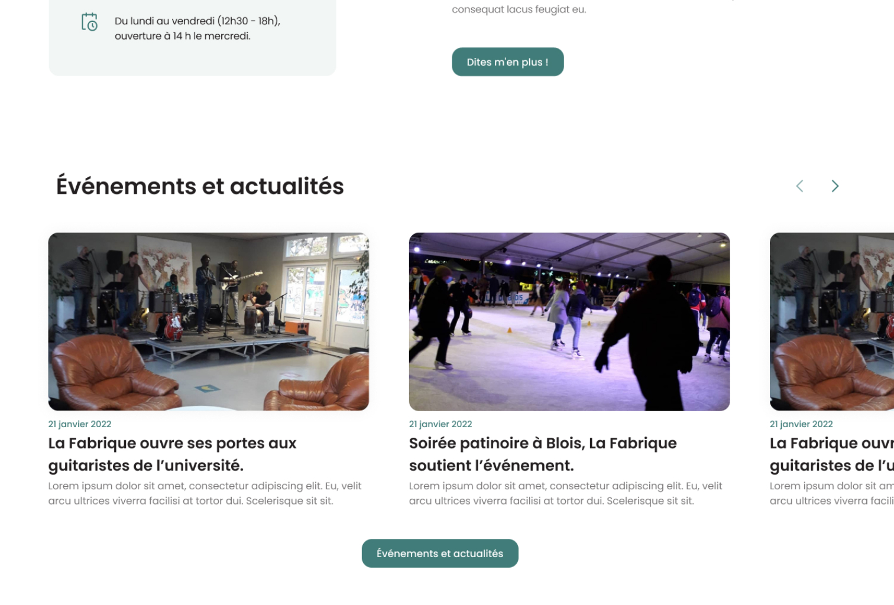
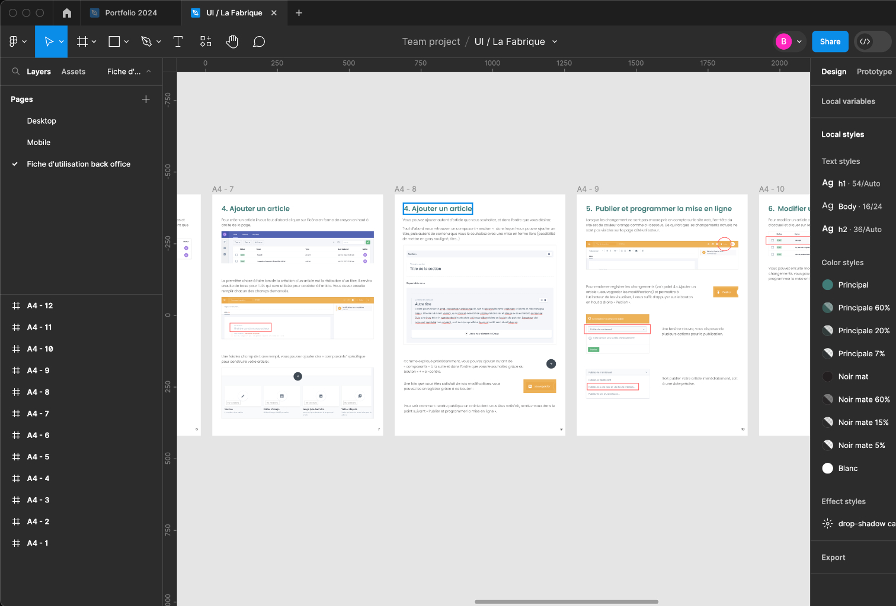

Lors du projet tutoré de ma deuxième année de DUT MMI, j'ai été chargé de la création du site de La Fabrique, le service jeunesse de la ville de Blois.

- [https://la-fabrique.netlify.app/](https://la-fabrique.netlify.app/)

Après avoir évalué les besoins du client, j'ai réalisé une maquette sur Figma et décidé de créer le site avec VueJS pour le front et Prismic pour le back. Ce choix a été fait afin de permettre au client de modifier facilement le contenu du site en considérant le temps limité pour la réalisation du projet.

Je me suis également occupé de la mise en ligne ainsi que de la création de fiches explicatives pour le client afin qu'il puisse modifier le contenu du site.

Le site est hébergé sur Netlify et le code [est disponible sur Github](https://github.com/baptistejouin/la-fabrique-blois)
