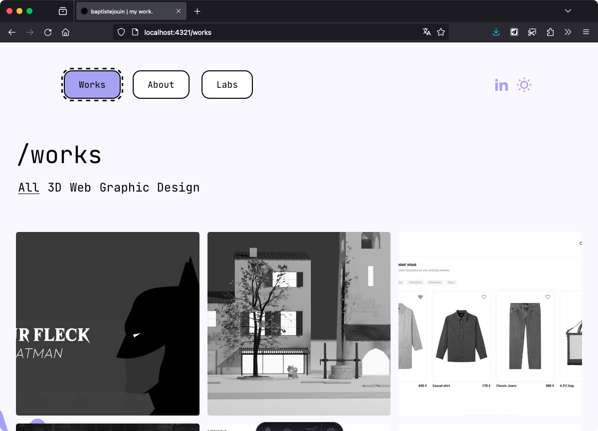
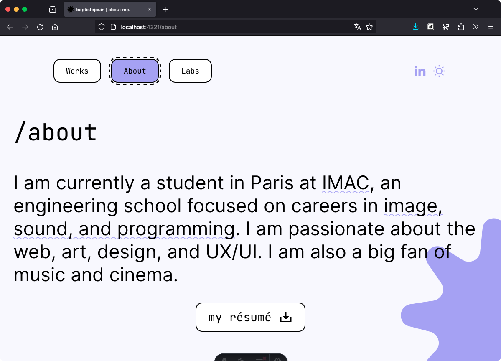

Fin 2023 j'ai décidé de refaire mon site web. J'ai donc commencé à réfléchir à la structure du site, et à son design. J'ai commencé par faire une maquette sur Figma, puis j'ai commencé à coder le site.

J'ai choisi d'utiliser Astro, un framework SSG (Static Site Generator). Il permet de générer un site web statique à partir de fichiers Astro, un langage similaire à JSX, et de fichiers Markdown. Il permet également de scinder le code en composants, et de les réutiliser.

Il supporte également SASS, TypeScript, et bien d'autres fonctionnalités.

Il me permet de pouvoir créer des pages de projet facilement, à partir du `layout` que j'ai créé. Il me suffit de créer un fichier Markdown, et de le placer dans le dossier `src/pages/works/`. Le site est ensuite généré automatiquement.

Grâce à Netlify, le site est déployé automatiquement à chaque commit sur la branche `main` depuis mon dépôt Github.

J'ai ainsi pu créer mon site web en quelques jours, sa maintenance est très simple, son deployment automatique, tout en restant très performant pour le référencement.
